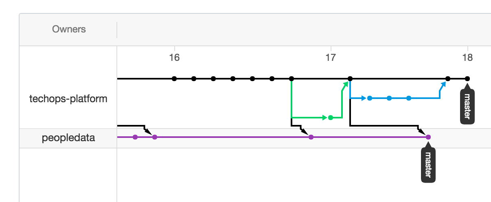

# Customising a Platform Repository
We know that the platform repositories won't be _exactly_ what you need, the idea is they will get you 90% of the way there, but then give you customisation capability to do that last 10% yourself.

The idea is that your product team can fork a `platform-` repository into it's own organisation and maintain that long lived fork, pulling updates from the upstream when it suits you.

To create a product team specific implementation:

  1. Fork the repository to your organisation namespace.  For example; fork `techops-platform/platform-app-gocd-kube` to `your-product-team/platform-app-gocd-kube`.
  2. Read the [Convention for Platform Repo Structure](platform-repo-convention.md), as well as the README.md of your fork to understand where you should place your customisations in order to minimise the chance of merge conflicts when pulling in updates.
  3. Clone the fork on your machine `git clone git@github.com:your-product-team/platform-app-gocd-kube.git`.
  4. Add an "upstream", with `git remote add upstream https://github.com/techops-platform/platform-app-gocd-kube`.
  5. Keep an eye on the upstream, and stay up to date by pulling in the upstream with `git pull upstream master`
